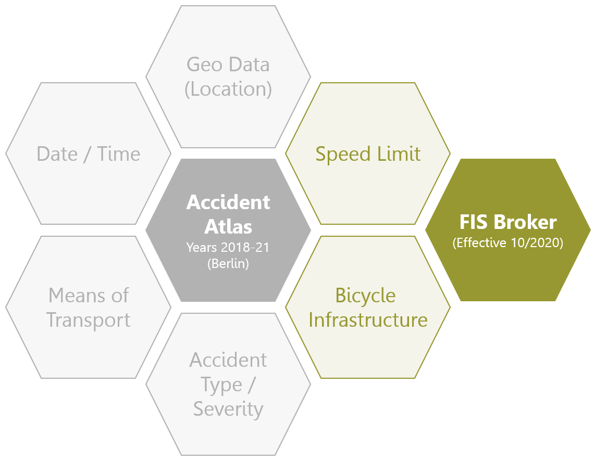

# Analysis of Bicycle Accidents in Berlin

## About

The statistical offices of the German federal and state governments publish all traffic accidents on a yearly basis in a 
so-called "Accident Atlas" (DE: Unfallatlas). Purpose of this project is to enrich the available datasets by additional 
information from other sources. In the first steps, that includes speed limits and bicycle infrastructure (RVA) such as bike lanes.
By extending the accident data by road conditions such as speed limit and RVA, a more comprehensive analysis regarding 
road safety can be conducted. 

## Data Sources

- Accident Data: [Accident Atlas](https://unfallatlas.statistikportal.de/_opendata2022.html)
- Berlin road network: [FIS Broker / Detailnetz Berlin](https://fbinter.stadt-berlin.de/fb/index.jsp?loginkey=zoomStart&mapId=k_vms_detailnetz_wms_spatial@senstadt&bbox=388980,5818643,394311,5822417)
- Berlin speed limits: [FIS Broker / Tempolimits](https://fbinter.stadt-berlin.de/fb/index.jsp?loginkey=zoomStart&mapId=k_vms_tempolimits_spatial@senstadt&bbox=388980,5818643,394311,5822417)
- Berlin bicycle infrastructure: [FIS Broker / Radverkehrsanlagen](https://fbinter.stadt-berlin.de/fb/index.jsp?loginkey=zoomStart&mapId=wmsk_radverkehrsanlagen@senstadt&bbox=383956,5818321,392703,5824512)

## Workflow

- Preprocessing: `preprocessing.py` 
  - data consolidation: combination of yearly Germany-wide datasets into one dataset for Berlin
  - filter: only keep bicycle accidents in Berlin
  - create unique identifier for accidents
  - create ranks for roads and RVA
  - CRS harmonization
- Spatial Operations: 
  - buffering of line and point geometries for spatial joins
  - spatial joins to add speed limit and RVA information to bicycle accidents
  - speed limit determination and prioritization 
- Graphical Analysis: 
  - Heatmap for absolut number of accidents for speed limits/RVA
  - bar plots for relative distribution of accidents
- Cluster Maps: 
  - accidents hotspots in Berlin for different criteria

**Note:** all notebooks require GeoPackage `map_data.gpkg`, which is provided in the `output` folder of this repo. 
It is the result of `preprocessing.py`. The required input data for this file will not be provided in this repo and
must be acquired by the user from the above-mentioned data sources.
